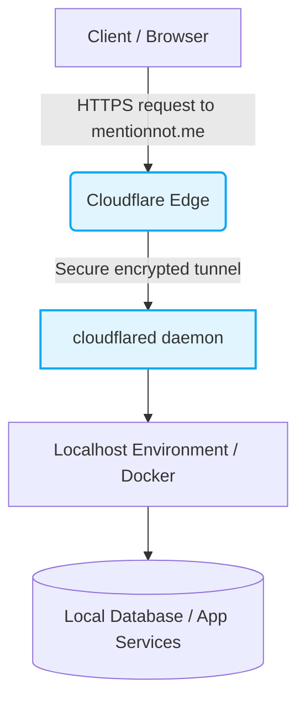

# 🎬 Project Documentary: mentionnot.me

> **Purpose:** Establishing a secure, zero-trust localhost tunnel to expose our development environment to the public web using a custom domain.
> **Live Demo:** [https://mentionnot.me](https://mentionnot.me)

---

## 🏗 Architecture

The system architecture is designed for scalability, security, and developer velocity. Below is a high-level representation of our data flow and component interaction.

---

## 🛠 Tech Stack

Our technology choices were driven by the need for a robust, easily deployable, and secure application:

- **Frontend/Backend:** Next.js / Local Dev Stack - Running locally but exposed globally.
- **Containerization:** Docker - Ensures parity between development and production environments.
- **Networking/Security:** **Cloudflare Tunnel (cloudflared)** - Crucial for exposing our local/internal services securely on `mentionnot.me` without opening inbound ports on the firewall or dealing with NAT routing.
- **DNS Management:** Cloudflare DNS - To route the custom domain seamlessly to our secure tunnel.

---

## 🧗 Challenges Faced

Building this project wasn't without its hurdles. Here are a few key challenges we encountered:

1. **Secure Ingress without Public IPs:** Exposing our local development application for testing/production without compromising the host network's security posture or opening port forwards on the router.
2. **Custom Domain Integration:** Seamlessly linking our newly acquired domain (`mentionnot.me`) to our local environment without relying on dynamic DNS or exposing our home/server IP.
3. **Environment Consistency:** Ensuring the tunneling solution works reliably across reboots and different development machines.

---

## 💡 Solutions Implemented

1. **Cloudflare Tunnel Integration:** By installing and authenticating the `cloudflared` daemon, we established an outbound-only connection to the Cloudflare edge. This allowed us to securely route traffic from `mentionnot.me` directly to our localhost without opening public IP addresses or managing complex firewall rules.
2. **Domain Configuration:** We successfully updated our domain's nameservers to Cloudflare, enabling us to manage DNS records and issue SSL/TLS certificates automatically at the edge.
3. **Zero-Trust Access:** Rather than relying on traditional VPNs, Cloudflare Tunnel provided a zero-trust model where only traffic routed through our specific Cloudflare configuration can reach our local service.

---

## 🚀 Deployment Strategy

Our deployment pipeline prioritizes security and automation:

1. **Local Daemon Setup:** `cloudflared` runs as a background service on the host machine, establishing a persistent connection to Cloudflare.
2. **Ingress Rules:** Configured tunnel ingress rules to map the public hostname `mentionnot.me` directly to the local port (e.g., `localhost:3000`).
3. **Instant Rollout:** Any changes made in the local development environment are instantly reflected on the live domain, vastly speeding up the testing and feedback loop.

---

## 🔑 Key Takeaways

- **Security First:** Abstracting network ingress via Cloudflare Tunnel significantly reduces the attack surface compared to traditional port forwarding.
- **Developer Velocity:** Having a production-grade URL (`mentionnot.me`) pointing to a local dev environment makes testing webhooks and sharing progress effortless.
- **Seamless DNS Management:** Consolidating DNS and tunneling under Cloudflare simplifies the infrastructure stack and automatically provides SSL.

---

## 📱 Social Media Excerpts

### 🟦 LinkedIn Post

**Audience:** Professional network, DevOps engineers, tech recruiters.

> Just achieved a major infrastructure milestone for **mentionnot.me**! 🚀
> 
> We needed a way to securely expose our local development environment to the public web without wrestling with router port forwarding or exposing our public IP. The solution? **Cloudflare Tunnel**. 
> 
> By connecting our new custom domain to Cloudflare and running the `cloudflared` daemon, we established a secure, outbound-only connection to the edge. This means zero firewall headaches, automated SSL, and a vastly improved security posture. 🔒
> 
> Testing webhooks and sharing live progress is now as simple as sharing a URL, all while the code runs safely on our local machines. 
> 
> I've documented the architecture, challenges, and deployment setup in our newly released Project Documentary. Check it out on GitHub! 👇
> 
> [Link to GitHub Repo]
> 
> What's your go-to strategy for secure local-to-public ingress? Let's discuss in the comments! 
> 
> #DevOps #Cloudflare #Infrastructure #Engineering #WebDevelopment #mentionnotme

### 🐦 X (Twitter) Thread

**Audience:** Tech community, developers, builders.

> **Tweet 1/4**
> Excited to share the architecture behind mentionnot.me! 🛠️ 
> We needed to securely expose our local dev environment without opening ports. Here’s a quick deep dive into how we solved this using Cloudflare Tunnel. A thread 🧵👇
> 
> **Tweet 2/4**
> The Challenge: Securely linking our new custom domain (mentionnot.me) to a local server without relying on dynamic DNS or exposing our public IP address to the internet. We needed it to be secure, fast, and reliable. 🛡️
> 
> **Tweet 3/4**
> The Solution: Cloudflare Tunnel (`cloudflared`). It creates a secure, outbound-only connection to the Cloudflare edge. Traffic hits mentionnot.me and routes securely to localhost. Zero firewall headaches, automated SSL, max security. 🔒☁️
> 
> **Tweet 4/4**
> Developer velocity is through the roof. We can now test webhooks and share live progress instantly. Read the full technical breakdown in our Project Documentary on GitHub! 🎬 
> 
> Check it out here: [Link to Repo] 
> Let me know what you think! #DevOps #BuildInPublic #WebDev
